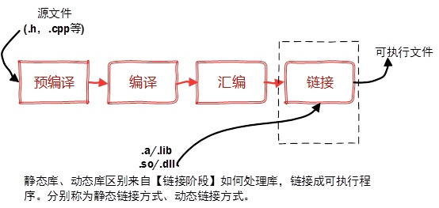

| 后缀 | 静态链接库 |静态库打包工具| 动态链接库 |
| --- | --- | ---- |--|
| windows | .lib |lib.exe| .ddl |
| linux | .a |ar| .so |

## 静态链接库
+ 汇编生成.o目标文件与引用的库一起链接到可执行文件中，对应的链接方式称为静态链接。
+ 一个静态库可以简单看成是一组目标文件（.o/.obj文件）的集合，即很多目标文件经过压缩打包后形成的一个文件。

### 特点
* 静态库对函数库的链接是放在编译时期完成的。
* 程序在运行时与函数库再无瓜葛，移植方便。
* 浪费空间和资源，因为所有相关的目标文件与牵涉到的函数库被链接合成一个可执行文件。

### linux上创建静态库
Linux静态库命名规范，必须是"lib[your_library_name].a"：lib为前缀，中间是静态库名，扩展名为.a

* 首先，将代码文件编译成目标文件.o（StaticMath.o）

	> g++ -c StaticMath.cpp

	注意带参数-c，否则直接编译为可执行文件

* 然后，通过ar工具将目标文件打包成.a静态库文件

	> ar -crv libstaticmath.a StaticMath.o

	生成静态库libstaticmath.a

## 动态链接库
* 动态库在程序编译时并不会被连接到目标代码中，而是在程序运行是才被载入。不同的应用程序如果调用相同的库，那么在内存里只需要有一份该共享库的实例，规避了空间浪费问题。
* 动态库在程序运行是才被载入，也解决了静态库对程序的更新、部署和发布页会带来麻烦。用户只需要更新动态库即可，增量更新。

### 特点
* 动态库把对一些库函数的链接载入推迟到程序运行的时期。
* 可以实现进程之间的资源共享。（因此动态库也称为共享库）
* 将一些程序升级变得简单。
* 甚至可以真正做到链接载入完全由程序员在程序代码中控制（显示调用）。
* 与创建静态库不同的是，不需要打包工具（ar、lib.exe），直接使用编译器即可创建动态库。

### linux上创建动态链接库
linux下动态库的生成通过GCC选项实现

* 首先我们生成目标文件，但是需要加编译器选项 -fpic 和链接器选项 -shared
	
	> $ gcc -fpic -c func1.c 
	> $ gcc -fpic -c func2.c
	> $ gcc -shared -o libfunc.so func1.o func2.o
* 查看当前目录

	> $ ls
	> func1.c  func1.o  func2.c  func2.o  libfunc.so  main.c
* libfunc.so 就是我们生成的目标动态库。我们用动态库和 main.c 生成目标程序
	> $ gcc -o main main.c -L. -lfunc
* 运行报错
	> $ ./main 

 	> ./main: error while loading shared libraries: libfunc.so: cannot open shared object file: No such file or directory
* 需要将.so文件复制到lib默认目录下，或者修改环境变量
	>  $ export LD_LIBRARY_PATH=`pwd`

### windows系统
 
* 在Windows系统下的执行文件格式是PE格式，动态库需要一个DllMain函数做出初始化的入口，通常在导出函数的声明时需要有_declspec(dllexport)关键字。
* Linux下gcc编译的执行文件默认是ELF格式，不需要初始化入口，亦不需要函数做特别的声明，编写比较方便。

参考于：https://www.cnblogs.com/king-lps/p/7757919.html
